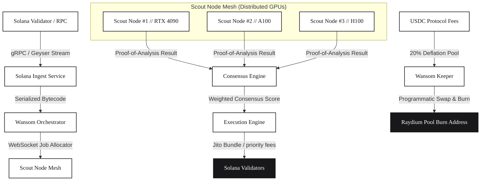
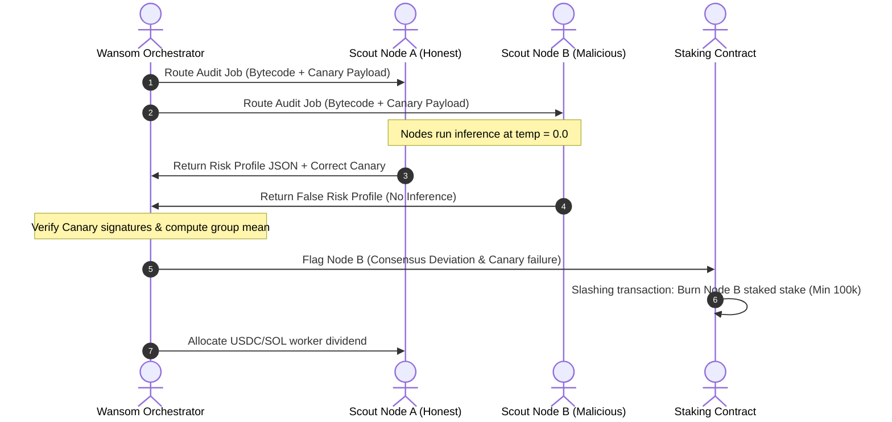

# WANSOM // Autonomous Decentralized LLM Orchestrator & Trading Network

Wansom is a decentralized, high-throughput cognitive execution layer built for volatile, high-frequency transaction environments on the Solana blockchain. By integrating decentralized GPU-accelerated LLM inference directly with sub-second on-chain routing wrappers, Wansom enables autonomous agents to audit, analyze, and trade micro-cap assets, liquidity pool launches, and smart contract bindings without human intervention.

---

## 1. Network Architecture

The Wansom system coordinates telemetry ingestion, job broker scheduling, distributed inference verification, and MEV-protected execution. Below is the end-to-end telemetry pipeline:



### Core Architecture Pillars

1. **Cognitive Autonomy**: Evaluates contracts using `Wansom-LLM-v1` (a quantized, low-latency LLM fine-tuned for Rust smart contract syntax, cryptographic signatures, and token creator metadata).
2. **Ephemeral Privacy Shield**: Enforces strict client-side key management. Strategic prompts, configuration matrices, and private keys reside in local memory enclaves (TEEs) and are never logged to centralized backends.
3. **Decentralized Compute Layer**: Distributes heavy LLM evaluations across a global, contributor-run GPU node network ("Scout Nodes") in exchange for `$WANSOM` emissions.

---

## 2. Proof-of-Analysis (PoA) Validation Pipeline

To prevent node collusion or lazy-reporting (returning fake inference scores to harvest rewards), Wansom implements a cryptographic validation pipeline:



*   **Canary Payloads**: The Orchestrator periodically inserts pre-audited token contracts with known risks into the validation queue. Nodes failing to return the expected safety profile are flagged.
*   **Consensus Aggregation**: Contracts are audited by three nodes concurrently. If a node's output consistently deviates from the group mean, its reputation score drops.
*   **Determinism Verification**: Scout nodes run quantized inference engines at a temperature of `0.0` using standardized seed values, rendering output responses deterministic and cryptographically verifiable.

---

## 3. Repository Layout

This workspace contains the complete stack, including frontend telemetry dashboards, typescript orchestrator servers, and Rust staking programs:

```text
wansom/
├── contracts/                  # Solana Anchor Smart Program
│   └── staking/
│       ├── Cargo.toml
│       └── src/
│           └── lib.rs          # Node register, PoA verification, and slashing logic
├── server/                     # TypeScript Orchestrator Server
│   ├── package.json
│   ├── tsconfig.json
│   ├── .env.example            # Template for environment configurations (secrets guarded)
│   └── src/
│       ├── index.ts            # REST API & WebSocket server bootstrapping
│       ├── geyser.ts           # gRPC transaction log simulator
│       ├── queue.ts            # Broker job routing & consensus calculator
│       └── keeper.ts           # Tokenomics buyback-and-burn keeper loop
├── src/                        # Client Dashboard (React / Tailwind v4)
│   ├── components/             # Telemetry, Scout Mesh, Playground, and Staking views
│   ├── App.jsx                 # Dashboard shell & browser extension wallet adapter
│   ├── index.css               # Design tokens (monochrome print editorial theme)
│   └── main.jsx
├── README.md                   # Platform technical reference manual
└── package.json
```

---

## 4. Developer Sandbox API Reference

Integrate the Wansom cognitive engine directly into custom execution modules using our OpenAI-compatible endpoint.

### Endpoint: `POST https://api.wansom.network/v1/chat/completions`

#### Header Configuration:
```http
Authorization: Bearer $WANSOM_API_KEY
Content-Type: application/json
```

#### Sample Request Body:
```json
{
  "model": "wansom-llm-v1",
  "messages": [
    {
      "role": "user",
      "content": "Perform structural risk audit and mint-authority check on Solana contract address: Hz1b9Pq7x9w2LmK4sJ3q9aA1xBcDeF23456789aA"
    }
  ],
  "temperature": 0.0,
  "response_format": { "type": "json_object" }
}
```

#### Sample Response Body:
```json
{
  "id": "wan-audit-8f3a1e9b2c",
  "object": "chat.completion",
  "created": 1719827291,
  "model": "wansom-llm-v1",
  "choices": [
    {
      "index": 0,
      "message": {
        "role": "assistant",
        "content": "{\n  \"contract_address\": \"Hz1b9Pq7x9w2LmK4sJ3q9aA1xBcDeF23456789aA\",\n  \"status\": \"RISK_DETECTED\",\n  \"safety_score\": 32.5,\n  \"metrics\": {\n    \"mint_authority_disabled\": false,\n    \"freeze_authority_disabled\": true,\n    \"renounced_ownership\": false,\n    \"liquidity_burned_percentage\": 0.0,\n    \"dev_token_allocation_ratio\": 0.42\n  },\n  \"vulnerabilities\": [\n    \"Active mint authority allows the deployer to inflate token supply arbitrarily.\",\n    \"Deployer holds 42% of the initial supply across three connected sybil wallets.\"\n  ],\n  \"recommendation\": \"IMMEDIATE_AVOID\"\n}"
      },
      "finish_reason": "stop"
    }
  ],
  "usage": {
    "prompt_tokens": 142,
    "completion_tokens": 168,
    "total_tokens": 310
  }
}
```

---

## 5. Local Setup & Deployment

### Security Configuration
Ensure a `.env` file is generated inside the `/server` folder by copying `server/.env.example`. Never commit the `.env` file or raw wallet keypair directories. Secret patterns are filtered out by `.gitignore` rules automatically.

### Running the Frontend
1. Install client dependencies:
   ```bash
   npm install
   ```
2. Start the Vite hot-module reload development server:
   ```bash
   npm run dev
   ```
3. Compile the React build files:
   ```bash
   npm run build
   ```

### Running the Orchestrator Server
1. Navigate to the server folder and install dependencies:
   ```bash
   cd server
   npm install
   ```
2. Launch the orchestrator in hot-reload development mode:
   ```bash
   npm run dev
   ```
